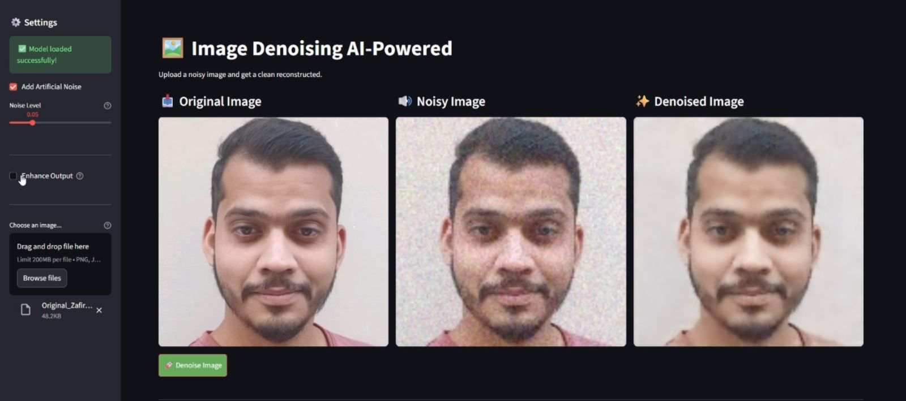

# Image-Denoising-AI-Powered

🚀 Image Denoising using U-Net Autoencoder using Deep Learning

I recently built an AI-powered image denoising system that removes noise from images and reconstructs a cleaner version using a deep learning model.

🔍 Project Highlights
- Implemented a U-Net based autoencoder architecture for image denoising
- Trained on 2000+ face images with synthetic Gaussian noise
- Achieved PSNR: 31.28 dB and SSIM: 0.929
- Built an interactive Streamlit web app for real-time inference

🧠 Tech Stack
Python • TensorFlow • Keras • OpenCV • NumPy • Streamlit

📊 Pipeline
Original Image → Noise Injection → U-Net Encoder-Decoder → Denoised Output

🎥 In the demo video below, you can see how the model removes noise and reconstructs a clean image.

This project helped me explore image restoration, autoencoders, and deep learning-based denoising techniques.
